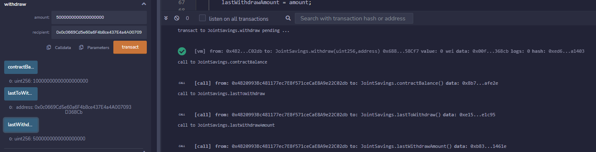

# Joint Savings
Solidity smart contract that accepts two user addresses to control a joint savings account

---

## Summary

To automate the creation of `joint savings` accounts, our Solidity smart contract accepts two user addresses. These addresses will be able to control a joint savings account. The `joint savings` smart contract uses ether management functions to implement a financial institution’s requirements for providing the features of the joint savings account. These features will consist of the ability to deposit and withdraw funds from the account.

The Joint Savings app contains the following files:

* The first file is called `joint_savings.sol`. It contains the Solidity Smart Contract.
* A folder named `Execution_Results` that contains images with examples of the execution of the smart contract
* This project uses an IDE [Remix](https://remix-project.org/) to deploy and run transactions in the blockchain

---
## Installation and Usage

```sh
git clone https://github.com/diegoalcocer/joint-savings.git
cd joint-savings/
```
Open the smart contract file (`joint_savings.sol`) using [Remix](https://remix.ethereum.org/), build it and deploy it

### 📚 usage

Open the smart contract and deploy it


Set the joint accounts


Transfer 1 ether as wei


Transfer 10 ether as wei


Transfer 5 ether


Withdraw 5 ether into account 1


Check balance and last to withdraw



Withdraw 10 ether into account 2 and check balance and last to withdraw


## License

[](https://www.gnu.org/licenses/gpl-3.0)
